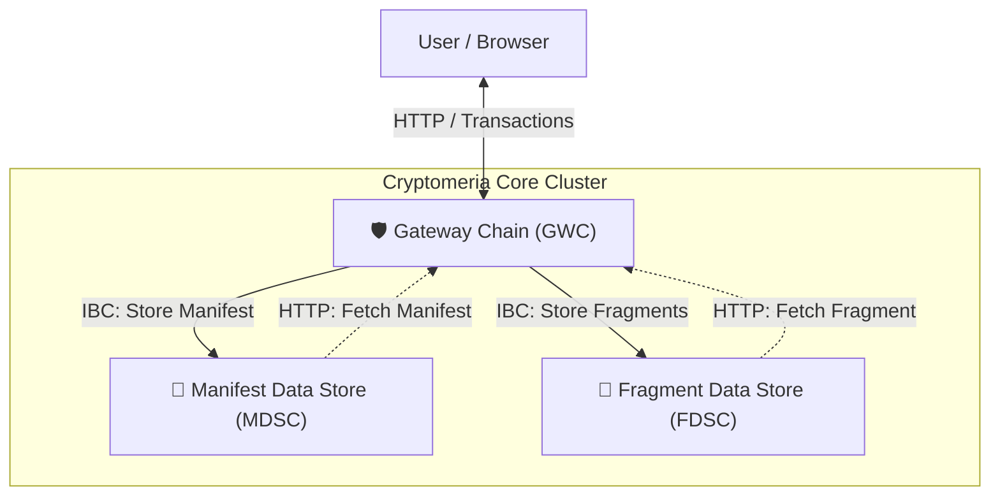

# 🏗️ Cryptomeria Core

**The Kernel of the Modular Inter-chain Web Hosting Ecosystem.**

Cryptomeria Coreは、Project Cryptomeriaの中核となるモノレポ（Monorepo）リポジトリです。
分散型Webホスティングを実現するための3種類のカスタムブロックチェーンの実装、Kubernetesインフラストラクチャ定義、および統合管理インターフェースを管理しています。

## 🧩 アーキテクチャ

本システムは、役割の異なる複数のブロックチェーンがIBC (Inter-Blockchain Communication) で連携し、データの保存と配信を行うモジュラーアーキテクチャを採用しています。



### コアコンポーネント (`apps/`)

| Component | Role | Description |
| :--- | :--- | :--- |
| **GWC** (Gateway Chain) | **Access Point** | ユーザーからのリクエスト受付、Zip解凍、データ分割（フラグメンテーション）、および各チェーンへの分散処理を行う揮発性チェーン。Webサーバーおよびゲートウェイとして機能します。 |
| **FDSC** (Fragment Data Store) | **Storage** | 分割されたバイナリデータ（Fragment）を実際に保存するストレージチェーン。水平スケーリングによる容量拡張を担います。 |
| **MDSC** (Manifest Data Store) | **Index** | 「どのファイルが、どのFDSCの、どこに保存されているか」というマッピング情報（Manifest Data）を管理するインデックスチェーン。 |

## 🔄 データフロー詳細

### ⬆️ アップロードフロー (Write)

クライアントからアップロードされたデータは、以下の順序で処理され、永続化されます。

1.  **Ingest (受信)**: GWCがクライアントからトランザクションとしてデータを受け取ります（ファイル単体、ディレクトリ、またはZIPファイル）。
2.  **Unzip & Analyze (解凍・解析)**: ZIPファイルを受け取った場合、GWCはメモリ上で展開（Unzip）し、ディレクトリ構造を解析します。
3.  **Fragmentation & Distribution (分割・分散)**: GWCはファイルを「フラグメント（断片）」に分割し、複数の **FDSC (Fragment Data Store Chain)** へIBCパケットを通じて分散保存します。
4.  **Manifest Indexing (インデックス化)**: 「どのFDSCに、どのファイルの、どのフラグメントを保存したか」という構造情報をまとめた **Manifest Data** を生成し、**MDSC (Manifest Data Store Chain)** へIBCパケットで送信・保存します。

### ⬇️ ダウンロードフロー (Read)

Webブラウザ等からのアクセス時は、逆の手順でデータが復元されます。

1.  **Resolve (解決)**: GWCがリクエストされたパスに基づき、**MDSC** から Manifest Data を **HTTPリクエスト** で取得します。
2.  **Fetch (取得)**: Manifestに含まれる場所情報に基づき、GWCが各 **FDSC** から必要なフラグメントを **HTTPリクエスト** で並列取得します。
3.  **Reconstruct (復元)**: GWCがフラグメントを結合して元のファイルを復元し、HTTPレスポンスとしてユーザーに返却します。

## 🔌 統合モジュール

本リポジトリは以下のコンポーネントをGit Submoduleとして統合しています。

  * **[apps/webui](https://github.com/projectcryptomeria/cryptomeria-webui)**: システム全体の運用・監視・実験を行うための管理コンソール。
  * **[apps/ts-controller](https://github.com/projectcryptomeria/cryptomeria-tscontroller)**: (Legacy) アップロード戦略のプロトタイピング用CLIツール。

## 🛠️ インフラストラクチャ (`ops/`)

Kubernetes上へのデプロイと運用を自動化するためのコード資産が含まれています。

  * **Helm Charts**: `ops/infra/k8s/helm` - 全チェーンとRelayerの一括デプロイ定義。
  * **CDK8s**: `ops/infra/cdk8s` - TypeScriptによるインフラ構成管理。
  * **Scripts**: `ops/scripts` - チェーンのScaffold、E2Eテスト、ベンチマーク用スクリプト。

## 🚀 開発の始め方

### 前提条件

開発には以下のツールが必要です（DevContainerの使用を推奨）。

  * Go 1.22+
  * Ignite CLI
  * Node.js & Yarn
  * Docker & Kubernetes (Minikube/Kind)
  * **[Just](https://github.com/casey/just)** (Task Runner)

### セットアップとビルド

本リポジトリはサブモジュールを含むため、再帰的にクローンしてください。

```bash
# Clone repository
git clone --recursive https://github.com/projectcryptomeria/cryptomeria-core.git
cd cryptomeria-core

# Check available commands
just --list
```

### 主なコマンド (via Justfile)

| Command | Description |
| :--- | :--- |
| `just install` | 依存関係のインストールと初期セットアップを行います。 |
| `just build` | 全てのチェーンバイナリ（gwcd, mdscd, fdscd）をビルドします。 |
| `just proto-gen` | Protobufファイルの生成と型定義の更新を行います。 |
| `just dev-up` | ローカルKubernetes環境へシステム全体をデプロイします（Skaffold/Helm）。 |
| `just test-e2e` | `ops/scripts/test` 内の統合テストを実行し、チェーン間の連携を確認します。 |

## 📂 ディレクトリ構造

```
cryptomeria-core/
├── apps/               # アプリケーションコード
│   ├── gwc/            # Gateway Chain (Ignite App)
│   ├── mdsc/           # Manifest Data Store Chain (Ignite App)
│   └── fdsc/           # Fragment Data Store Chain (Ignite App)
├── ops/                # 運用・インフラコード
│   ├── infra/          # Helm Charts, CDK8s
│   └── scripts/        # テスト、Scaffold用スクリプト
├── submodules/         # サブモジュール
│   ├── webui/          # WebUI (Submodule)
│   └── ts-controller/  # Legacy Controller (Submodule)
├── docs/               # 設計資料、仕様書
└── justfile            # タスクランナー定義
```

## 🔗 関連リポジトリ

  * **[Cryptomeria WebUI](https://github.com/projectcryptomeria/cryptomeria-webui)**
  * **[Cryptomeria TScontroller](https://github.com/projectcryptomeria/cryptomeria-tscontroller)**
<div align="center">
<sub>Managed by Project Cryptomeria</sub>
</div>
